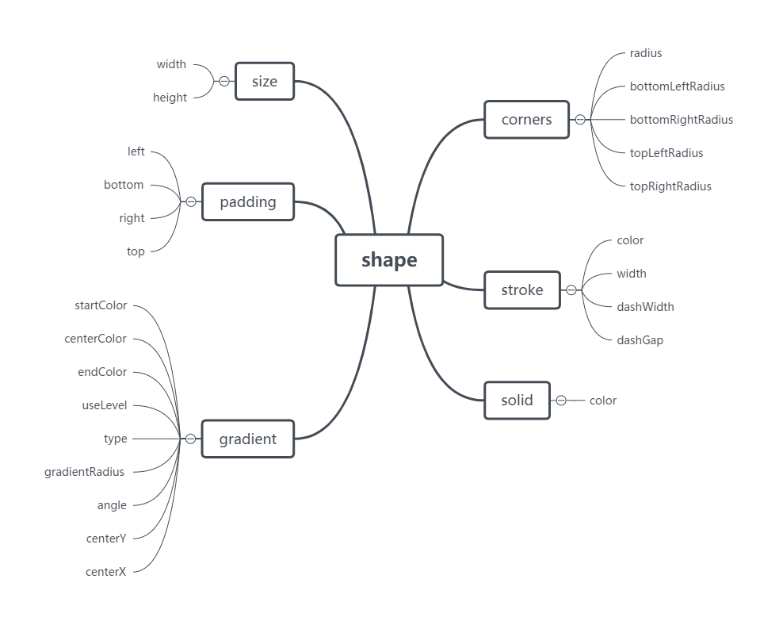
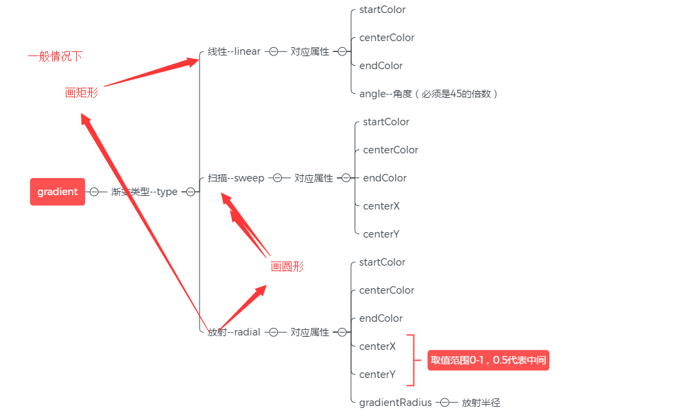

# shape
自定义样式

shape的6种特性：

gradient渐变的9个属性：

按钮样式：

实现方法：只是定义好样式，还需要进行引用；该样式是给background属性添加的，添加后就可以看到实例

<?xml version="1.0" encoding="utf-8"?> 
<shape xmlns:android="http://schemas.android.com/apk/res/android";
      android:shape="rectangle" > 

<!--一共有六个属性-->
<!--大小--> 
<size android:width="600dp" android:height="100dp"></size> 

<!--圆角-->
 <corners android:radius="50dp"></corners>

 <!--渐变--> 
<gradient android:startColor="#6fd99d" android:centerColor="#63cfc3" 
        android:endColor="#57c5e9"></gradient> 
</shape>

参考：
作者：一个自学的程序员
链接：https://www.jianshu.com/p/c3652a8c37ac
